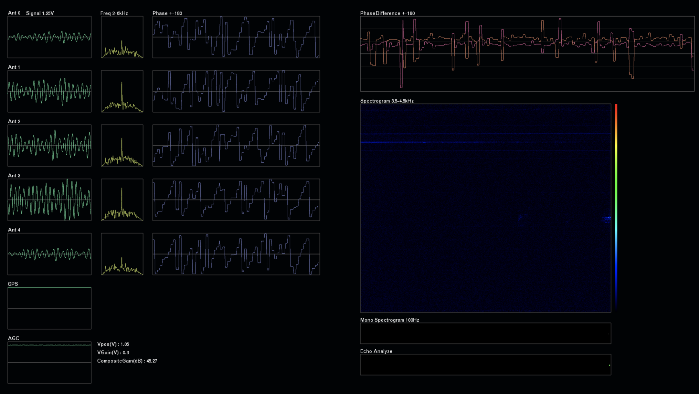

# 5ch Meteor Echo Interferometer
流星電波観測のための5chチャンネル干渉計リアルタイム解析アプリケーション。

・openFrameworks #of_v20180227_vs2015_release

## About meteor echo interferometer
[流星電波干渉計開発について](MEI_intro.pdf)

## collaborative research
[新HRO干渉計システムにおけるリアルタイム解析手法の確立と流星総合
観測の運用試験](https://confit.atlas.jp/guide/event-img/jpgu2019/PEM16-05/public/pdf?type=in&lang=ja)
